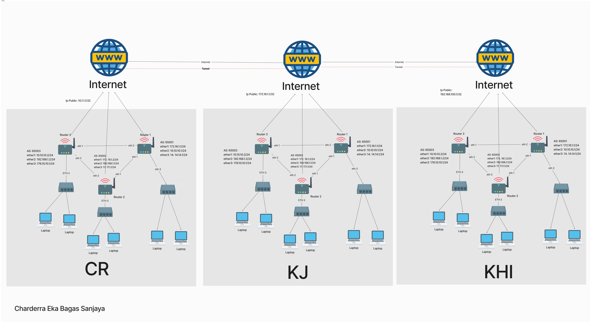

# Nama: Charderra Eka Bagas Sanjaya

# Nim: 20210801088

# Uas Jarkom Lanjut

# Soal: 
Buatlah Topologi dan Konfigurasi ruang lab praktikum Universitas Esa Unggul untuk masing masing kampus (CR, KHI, KJ) bagaimana agar mereka bisa terhubung dan terkoneksi dengan memanfaatkan routing statik, routing dinamik (BGP, RIP, OSPF). Kumpulkan semua ke github masing-masing.

# Penjelasan

- Routing Statik
Routing statik adalah metode pengaturan rute jaringan secara manual oleh seorang administrator jaringan. Setiap rute harus diinputkan secara spesifik dan perubahan dalam jaringan memerlukan pembaruan manual pada tabel routing. Kelebihan routing statik antara lain sederhana dan kontrol penuh oleh administrator, tetapi tidak skala dan memerlukan pemeliharaan yang intensif.

- Routing Dinamik
Routing dinamik menggunakan protokol untuk mendeteksi dan memperbarui jalur jaringan secara otomatis berdasarkan perubahan dalam topologi jaringan. Beberapa protokol routing dinamik yang populer adalah:

- BGP (Border Gateway Protocol)
BGP adalah protokol routing yang digunakan untuk bertukar informasi routing antara sistem otonom (AS) di internet. BGP sangat skalabel dan digunakan di jaringan besar seperti internet. Keunggulan BGP termasuk fleksibilitas dan kemampuan menangani sejumlah besar rute, tetapi kompleksitas konfigurasinya tinggi.

- RIP (Routing Information Protocol)
RIP adalah protokol routing yang menggunakan algoritma distance-vector untuk menentukan jalur terbaik. Setiap rute dinilai berdasarkan jumlah hop yang diperlukan untuk mencapai tujuan. RIP cocok untuk jaringan kecil karena kemudahannya, namun memiliki keterbatasan dalam skala dan efisiensi, terutama pada jaringan besar dengan lebih dari 15 hop.

- OSPF (Open Shortest Path First)
OSPF adalah protokol routing link-state yang menggunakan algoritma Dijkstra untuk menemukan jalur terpendek ke tujuan. OSPF sangat cepat dalam mendeteksi perubahan jaringan dan mengkonsolidasikan informasi rute dari seluruh jaringan. OSPF lebih kompleks dibandingkan RIP tetapi lebih efisien untuk jaringan besar.

# Topologi

